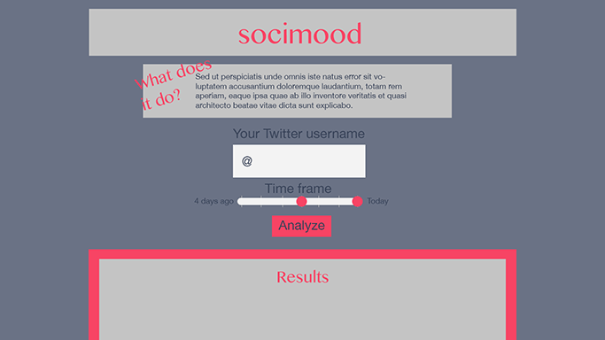

# Socimood

## Description
Socimood gives you insight into trends in your mood, tone, and sentiment of your social media posts over a period of time. A user will submit their twitter handle and a period of time to observe. Socimood will analyze the Tweets posted over that period of time and display an analysis of the content, informing them of positivity, negativity and intensity. Users will be able to see snapshots of the mood of their Twitter persona.

## Initial Designs

## Team Members and Roles
- Alexander Sanchez
- Thomas Cani
- Albert Gonzalez
- James Cherven

Each member will be choosing tasks from a Github issues list as they are added.

## Technologies Used
- HTML/CSS/Javascript
### Unique technologies to satisfy project rubric
- Twitter API for getting chunks of text containing Tweets
- text-processing.com API for analyzing tone and sentiment of Twitter content
- D3.js or P5.js (Processing) libraries for data visualization of user results

## Breakdown of tasks/schedule
1. ...
2. ...